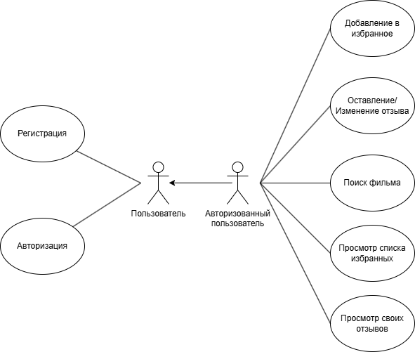
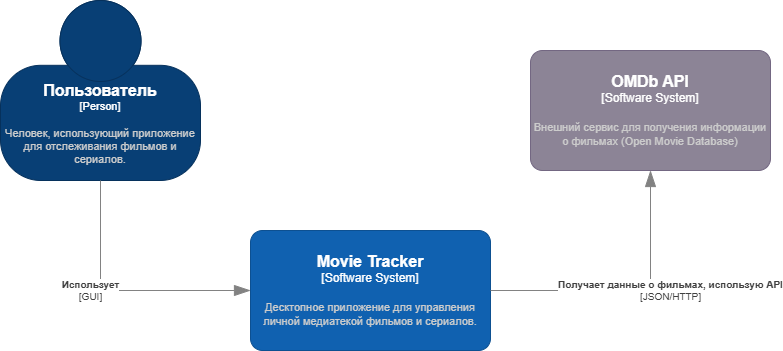

## Оглавление

1. [Состав команды](#состав-команды)
2. [Введение](#введение)
2. [Определение проблемы](#определение-проблемы)
3. [Цель](#цель)
4. [Описание Use-Case диаграммы](#описание-use-case-диаграммы)
5. [Разработка архитектуры и детальное проектирование](#разработка-архитектуры-и-детальное-проектирование)
6. [Кодирование и отладка](#кодирование-и-отладка)
7. [Unit тестирование](#unit-тестирование)
8. [Интеграционное тестирование](#интеграционное-тестирование)
9. [Пример работы приложения](#пример-работы-приложения)
10. [Установка и запуск](#установка-и-запуск)

## Состав команды:
1. Алексеенко Егор Владиславович, группа 5130202/20201
2. Лонишин Максим Русланович, группа 5130202/20201
3. Пелипейченко Денис Андреевич, группа 5130202/20201

## Определение проблемы

Пользователям, интересующимся фильмами, сложно отслеживать свои предпочтения, оценки и отзывы в одном месте. 
Существующие платформы часто либо перегружены функциями (социальные сети, рекомендации), 
либо неудобны для персонального использования (заметки, таблицы). 
В результате, пользователям приходится использовать несколько разрозненных инструментов, 
чтобы вести учёт любимых фильмов и своих впечатлений о них.

## Цель

Создать простой и удобный инструмент для отслеживания фильмов, которые пользователь смотрел.

## Выработка требований

### Use Case

### Описание Use-Case диаграммы:
Диаграмма вариантов использования иллюстрирует взаимодействие Пользователя с системой "Movie Tracker". Пользователь может выполнять следующие действия:
* Регистрация: Создание новой учетной записи.
* Авторизация: Вход в существующую учетную запись.
* Поиск фильмов/сериалов: Поиск медиаконтента по названию, году, типу через внешний сервис (OMDb API).
* Просмотр информации о фильме/сериале: Получение детальной информации о выбранном элементе (также через OMDb API).
* Добавление фильма/сериала в избранное: Сохранение понравившегося фильма/сериала в личный список.
* Удаление фильма/сериала из избранного: Удаление элемента из списка избранного.
* Просмотр списка избранного: Отображение личного списка избранных фильмов/сериалов.
* Оставление/Изменение отзыва и рейтинга: Пользователь может поставить оценку (1-5) и написать текстовый комментарий к фильму/сериалу.
* Просмотр своих отзывов: Отображение списка всех оставленных пользователем отзывов.

### Сценарии вариантов использования

**I) Зарегистрировать нового пользователя**

*   **Основное действующее лицо:** Пользователь.
*   **Триггер:** Пользователь выбирает опцию "Регистрация" и нажимает кнопку "Зарегистрироваться" после ввода данных.
*   **Гарантия успеха:** Учетная запись пользователя успешно создана в системе. Пользователь получает сообщение об успешной регистрации.
*   **Основной сценарий:**
    1.  Пользователь вводит имя пользователя, пароль и подтверждение пароля в соответствующие поля на форме регистрации.
    2.  Пользователь нажимает кнопку "Зарегистрироваться".
    3.  Система проверяет корректность введенных данных (заполненность полей, минимальная длина пароля, совпадение паролей).
    4.  Система проверяет уникальность имени пользователя в базе данных.
    5.  Система хеширует пароль и сохраняет данные нового пользователя в базе данных.
    6.  Система отображает сообщение "Пользователь успешно зарегистрирован. Теперь вы можете войти, используя свои данные."
*   **Расширения:**
    *   **1.a.** Имя пользователя уже существует в системе.
        *   **1.a.1.** Система отображает сообщение об ошибке "Пользователь с таким именем уже существует." Пользователь может изменить имя пользователя и повторить попытку.
    *   **1.b.** Введенные пароли не совпадают.
        *   **1.b.1.** Система отображает сообщение об ошибке "Пароли не совпадают." Пользователь может исправить пароли и повторить попытку.
    *   **1.c.** Пароль слишком короткий (менее 6 символов).
        *   **1.c.1.** Система отображает сообщение об ошибке "Пароль должен быть не менее 6 символов." Пользователь должен ввести более длинный пароль.
    *   **1.d.** Одно или несколько полей не заполнены.
        *   **1.d.1.** Система отображает сообщение об ошибке "Все поля должны быть заполнены."

---

**II) Авторизоваться в системе**

*   **Основное действующее лицо:** Пользователь.
*   **Триггер:** Пользователь вводит имя пользователя и пароль на форме входа и нажимает кнопку "Войти".
*   **Гарантия успеха:** Пользователь успешно вошел в систему. Открывается главное окно приложения.
*   **Основной сценарий:**
    1.  Пользователь вводит свое имя пользователя и пароль в соответствующие поля на форме входа.
    2.  Пользователь нажимает кнопку "Войти".
    3.  Система находит пользователя в базе данных по имени пользователя.
    4.  Система проверяет введенный пароль, сравнивая его хеш с сохраненным хешем в базе данных.
    5.  В случае успеха, система отображает сообщение "Вход выполнен успешно" и открывает главное окно приложения.
*   **Расширения:**
    *   **1.a.** Пользователь с таким именем не найден.
        *   **1.a.1.** Система отображает сообщение об ошибке "Пользователь не найден."
    *   **1.b.** Введен неверный пароль.
        *   **1.b.1.** Система отображает сообщение об ошибке "Неверный пароль."
    *   **1.c.** Одно или несколько полей не заполнены.
        *   **1.c.1.** Система отображает сообщение об ошибке "Введите имя пользователя и пароль."

---

**III) Найти фильм/сериал**  (исправить пункт 3, 5)

*   **Основное действующее лицо:** Пользователь.
*   **Триггер:** Пользователь вводит название фильма/сериала (опционально год, тип) на вкладке "Поиск фильмов" и нажимает кнопку "Поиск".
*   **Гарантия успеха:** Пользователь получает список фильмов/сериалов, соответствующих его запросу.
*   **Основной сценарий:**
    1.  Пользователь вводит текст для поиска в поле "Введите название фильма/сериала...".
    2.  Пользователь нажимает кнопку "Поиск".
    3.  Система формирует запрос к OMDb API на основе введенного текста, года и типа (если указаны).
    4.  Система отправляет запрос и получает ответ от OMDb API.
    5.  Если требуется фильтрация по рейтингу, система получает детали для каждого найденного фильма и фильтрует результаты.
    6.  Система отображает список найденных фильмов/сериалов (название, год, тип) на вкладке.
    7.  Система отображает сообщение "Найдено: X результатов."
*   **Расширения:**
    *   **1.а.** Фильмы/сериалы по запросу не найдены (OMDb API вернул "Movie not found.").
        *   **1.а.1.** Система отображает сообщение "Ничего не найдено." Список результатов пуст.
    *   **1.b.** Произошла ошибка при обращении к OMDb API (например, таймаут, проблема с API ключом, кроме "Movie not found.").
        *   **1.b.1.** Система отображает сообщение об ошибке API (например, "Ошибка API или сети. Проверьте консоль." или более конкретное сообщение от API).
    *   **1.c.** Поле поиска пустое.
        *   **1.c.1.** Система отображает предупреждение "Введите название для поиска."

---

**IV) Добавить фильм/сериал в избранное**

*   **Основное действующее лицо:** Пользователь.
*   **Триггер:** Пользователь выбирает фильм/сериал из списка результатов поиска (или другого списка, где это возможно) и нажимает кнопку "Добавить в избранное".
*   **Гарантия успеха:** Выбранный фильм/сериал добавлен в список избранного пользователя. Пользователь получает сообщение об успешном добавлении.
*   **Основной сценарий:**
    1.  Пользователь выбирает фильм/сериал из отображаемого списка.
    2.  Пользователь нажимает кнопку "Добавить в избранное".
    3.  Система извлекает данные о выбранном фильме (название, год, IMDb ID, тип, URL постера).
    4.  Система сохраняет эти данные в таблицу `favourites` базы данных, связывая их с ID текущего пользователя.
    5.  Система отображает информационное сообщение "Успешно добавлено в избранное".
*   **Расширения:**
    *   **1.а.** Фильм/сериал уже находится в списке избранного данного пользователя.
        *   **1.а.1.** Система отображает предупреждение (например, "Ошибка при добавлении в избранное").
    *   **1.б.** Произошла ошибка при сохранении данных в базу.
        *   **1.б.1.** Система отображает сообщение об ошибке "Ошибка при добавлении в избранное".
    *   **1.в.** Фильм/сериал не выбран в списке.
        *   **1.в.1.** Система отображает предупреждение "Фильм не выбран."

---

**V) Просмотреть список избранных фильмов/сериалов**

*   **Основное действующее лицо:** Пользователь.
*   **Триггер:** Пользователь переходит на вкладку "Избранное".
*   **Гарантия успеха:** Пользователь видит список своих избранных фильмов/сериалов.
*   **Основной сценарий:**
    1.  Пользователь выбирает вкладку "Избранное".
    2.  Система запрашивает из базы данных все записи из таблицы `favourites`, принадлежащие текущему пользователю.
    3.  Система отображает полученный список фильмов/сериалов.
    4.  Система отображает сообщение "Загружено: X фильмов."
*   **Расширения:**
    *   **1.а.** Список избранного пуст.
        *   **1.а.1.** Система отображает сообщение "Список избранного пуст."

---

**VI) Просмотреть свои отзывы**

*   **Основное действующее лицо:** Пользователь.
*   **Триггер:** Пользователь переходит на вкладку "Мои отзывы".
*   **Гарантия успеха:** Пользователь видит список всех оставленных им отзывов.
*   **Основной сценарий:**
    1.  Пользователь выбирает вкладку "Мои отзывы".
    2.  Система запрашивает из базы данных все записи из таблицы `reviews`, где `user_id` соответствует ID текущего пользователя.
    3.  Система отображает полученный список отзывов (название фильма, рейтинг, превью комментария).
    4.  Система отображает сообщение "Загружено: X отзывов."
*   **Расширения:**
    *   **1.а.** Пользователь еще не оставлял отзывов.
        *   **1.а.1.** Система отображает сообщение "Вы еще не оставили ни одного отзыва."

## Разработка архитектуры и детальное проектирование

### Характер нагрузки на сервис

Ожидаемое количество пользователей в сутки: 20 000.
Период хранения данных: более 7 лет.

### Диаграммы C4

#### Диаграмма контекста

#### Диаграмма контейнеров

### Контракты API

### Нефункциональные требования

Приложение "Movie Tracker" разработано с учетом следующих нефункциональных требований:

*   **Производительность:**
    *   Время отклика на поиск фильмов через OMDb API: в пределах 2-3 секунд (зависит от скорости ответа внешнего API).
    *   Загрузка списков избранного и отзывов пользователя (при умеренном количестве записей, до ~100): менее 1 секунды.
*   **Надежность:**
    *   Приложение должно корректно обрабатывать ошибки сети при взаимодействии с OMDb API (например, таймауты, отсутствие интернет-соединения), информируя пользователя о проблеме.
*   **Безопасность:**
    *   Пароли пользователей хранятся в базе данных в хешированном виде с использованием алгоритма bcrypt.
    *   Конфиденциальные данные, такие как API ключ для OMDb, загружаются из локального `.env` файла и не являются частью исходного кода, распространяемого в репозитории.
*   **Удобство использования (Usability):**
    *   Интерфейс приложения интуитивно понятен и прост в освоении.
    *   Основные функции (поиск, добавление в избранное, управление отзывами) легко доступны через соответствующие вкладки и кнопки.
*   **Поддерживаемость:**
    *   Код проекта структурирован по модулям (backend, frontend), что облегчает его понимание, модификацию и дальнейшее развитие.
    *   Зависимости проекта управляются через файл `requirements.txt`.

### Схема базы данных

Приложение использует реляционную базу данных PostgreSQL для хранения информации о пользователях, 
их списках избранных фильмов и оставленных отзывах. Схема базы данных состоит из следующих основных таблиц:

1.  **`users` (public.users)**
    *   Хранит информацию о зарегистрированных пользователях.
    *   **Поля:**
        *   `id`: `INTEGER` (Primary Key, Autoincrement) - Уникальный идентификатор пользователя.
        *   `username`: `TEXT` (Unique) - Имя пользователя, используемое для входа.
        *   `password_hash`: `TEXT` - Хешированный пароль пользователя.
        *   `created_at`: `DATETIME` (Default: `now()`) - Дата и время регистрации пользователя.

2.  **`favourites` (public.favourites)**
    *   Хранит информацию о фильмах и сериалах, добавленных пользователями в избранное.
    *   **Поля:**
        *   `id`: `INTEGER` (Primary Key, Autoincrement) - Уникальный идентификатор записи в избранном.
        *   `title`: `TEXT` - Название фильма/сериала.
        *   `year`: `TEXT` - Год выпуска.
        *   `imdb_id`: `TEXT` - Уникальный идентификатор фильма/сериала на IMDb.
        *   `type_`: `TEXT` - Тип контента (например, "movie", "series").
        *   `poster_url`: `TEXT` - URL-адрес постера.
        *   `added_at`: `DATETIME` (Default: `now()`) - Дата и время добавления в избранное.
        *   `user_id`: `INTEGER` (Foreign Key -> `users.id`) - Идентификатор пользователя, которому принадлежит эта запись.

3.  **`reviews` (public.reviews)**
    *   Хранит отзывы и рейтинги, оставленные пользователями к фильмам/сериалам.
    *   **Поля:**
        *   `id`: `INTEGER` (Primary Key, Autoincrement) - Уникальный идентификатор отзыва.
        *   `user_id`: `INTEGER` (Foreign Key -> `users.id`, Not Null) - Идентификатор пользователя, оставившего отзыв.
        *   `imdb_id`: `VARCHAR(20)` (Not Null) - Идентификатор фильма/сериала на IMDb, к которому относится отзыв.
        *   `movie_title`: `TEXT` (Not Null) - Название фильма/сериала (для удобства отображения).
        *   `rating`: `INTEGER` (Not Null) - Оценка, поставленная пользователем (например, от 1 до 5).
        *   `comment`: `TEXT` (Nullable) - Текстовый комментарий пользователя.
        *   `created_at`: `TIMESTAMP` (Default: `now()`) - Дата и время создания или последнего обновления отзыва.
    *   **Ограничения:**
        *   `_user_movie_review_uc`: `UNIQUE (user_id, imdb_id)` - Гарантирует, что один пользователь может оставить только один отзыв на один и тот же фильм/сериал.

**Отношения между таблицами:**

*   Один пользователь (`users`) может иметь множество записей в избранном (`favourites`). (`users` 1 -> M `favourites`)
*   Один пользователь (`users`) может оставить множество отзывов (`reviews`). (`users` 1 -> M `reviews`)
*   Один фильм (определяемый по `imdb_id`) может иметь множество отзывов от разных пользователей.

Эта структура обеспечивает целостность данных и эффективное выполнение запросов для основных функций приложения.

### Масштабирование при росте нагрузки в 10 раз

## Кодирование и отладка

### Стек технологий

*   **Frontend:**
    *   PyQT6 - для создания графического интерфейса приложения.
*  **Backend:**
    *   Python - основной язык программирования.
    *   PostgreSQL - реляционная база данных для хранения информации о пользователях, избранных фильмах и отзывах.
    *   SQLAlchemy - для работы с базой данных PostgreSQL.
    *   alembic - для управления миграциями базы данных.
    *   OMDb API - для получения информации о фильмах и сериалах.
    *   Requests - для выполнения HTTP-запросов к OMDb API.
    *   bcrypt - для хеширования паролей пользователей.
    *   dotenv - для загрузки конфиденциальных данных (например, API ключа) из `.env` файла.
    *   unittest - для написания и выполнения тестов.

### Структура проекта

## Unit тестирование

## Интеграционное тестирование

## Пример работы приложения
Окно регистрации/входа:

После входа в приложение пользователь переходит на главное окно. Оно выглядит так:

Далее пользователь может воспользоваться поиском:

Далее пользователь может оставить отзыв для одного из фильмов, которые появились в поиске:

Пользователь также может открыть окно, где будет показаны все его уже существующие отзывы. 

Также пользователь может отрыть окно с избранными фильмами, которые он сохранил ранее.

## Установка и запуск
